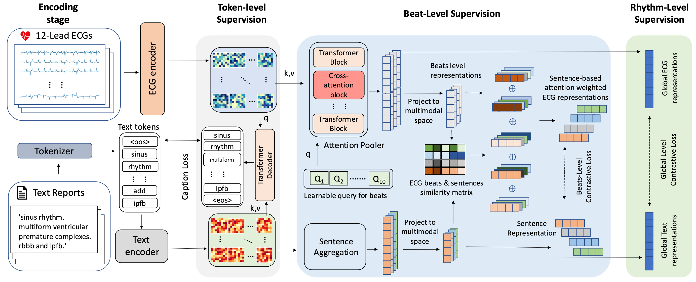

# MELP

<b>From Token to Rhythm: A Multi-Scale Approach for ECG-Language Pretraining</b>, ICML 2025.
<br><em>Fuying Wang, Jiacheng Xu, and Lequan Yu</em></br>

[Arxiv]() | [Cite](#acknowledgements) | [HuggingFace](https://huggingface.co/fuyingw/MELP_Encoder)

**Abstract**: Electrocardiograms (ECGs) play a vital role in monitoring cardiac health and diagnosing heart diseases. However, traditional deep learning approaches for ECG analysis rely heavily on large-scale manual annotations, which are both time-consuming and resource-intensive to obtain. To overcome this limitation, self-supervised learning (SSL) has emerged as a promising alternative, enabling the extraction of robust ECG representations that can be efficiently transferred to various downstream tasks. While previous studies have explored SSL for ECG pretraining and multi-modal ECG-language alignment, they often fail to capture the multi-scale nature of ECG signals. As a result, these methods struggle to learn generalized representations due to their inability to model the hierarchical structure of ECG data. To address this gap, we introduce MELP, a novel Multi-scale ECG-Language Pretraining (MELP) model that fully leverages hierarchical supervision from ECG-text pairs. MELP first pretrains a cardiology-specific language model to enhance its understanding of clinical text. It then applies three levels of cross-modal supervision—at the token, beat, and rhythm levels—to align ECG signals with textual reports, capturing structured information across different time scales. We evaluate MELP on three public ECG datasets across multiple tasks, including zero-shot ECG classification, linear probing, and transfer learning. Experimental results demonstrate that MELP outperforms existing SSL methods, underscoring its effectiveness and adaptability across diverse clinical applications.



## Updates
- 20/11/2024: The first version of MELP code base is now alive.

## Installation 

```
conda create -n melp python=3.10
conda activate melp
pip install -r requirements.txt
pip install -e .
```

## Dataset Preparation

Before running, please config the `RAW_DATA_PATH` of `src/melp/paths.py` into your corresponding path.

```
RAW_DATA_PATH
|- mimic-iv-ecg
|- ptbxl
|- icbeb
|- chapman
```

## Walkthrough of MELP

## Pretraining Stage

```
cd scripts/pretrain
CUDA_VISIBLE_DEVICES=0,1,2,3 python main_pretrain.py --num_devices 4 --train_data_pct 1 \
    --text_encoder_name fuyingw/heart_bert \
    --lr 2e-4 --model_name melp --batch_size 64 --max_epochs 100 \
    --ecg_encoder_name ecgfm \
    --clip_loss_weight 1.0 --caption_loss_weight 2.0 --local_loss_weight 0.2
```

## Evaluation 

### Linear Probing

```
cd scripts/finetune
CUDA_VISIBLE_DEVICES=0 python main_finetune.py \
    --model_name melp --dataset_name icbeb \
    --train_data_pct 0.01 \
    --ckpt_path CKPT_PATH \
    --num_devices 1
```

### Zero-shot Classification
```
cd scripts/zeroshot
python test_zeroshot.py
```

## Acknowledgements
If you find our work useful in your research or if you use parts of our code, please cite our paper:
```
```
